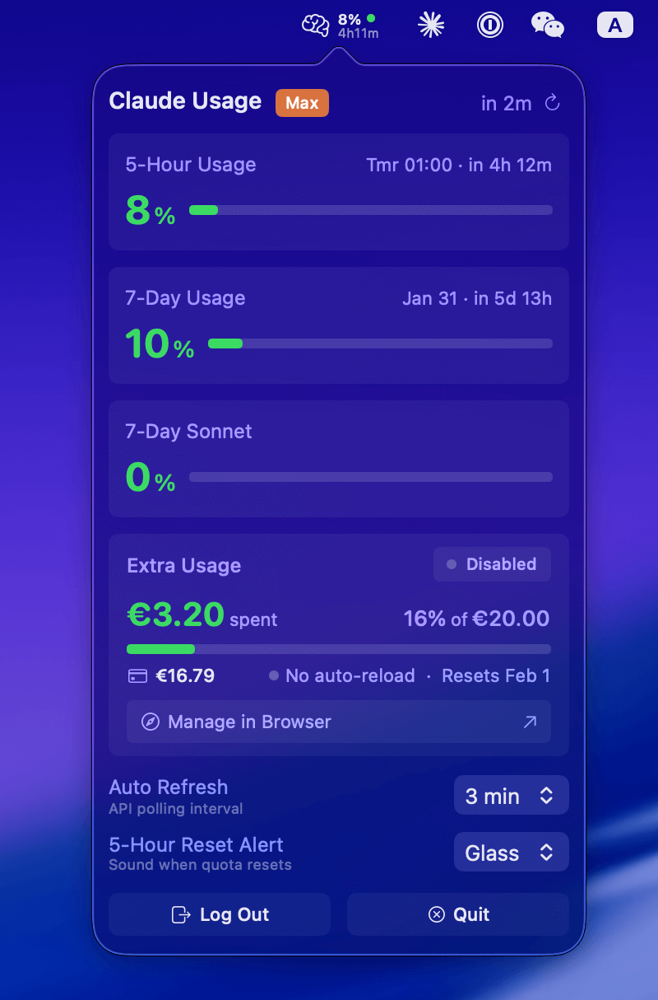

# 🧠 Claude Usage Menubar

A macOS menubar app that displays your Claude.ai usage statistics.


<p align="center">
  
</p>

## Disclaimer

> **This is an unofficial tool, created as a learning project for "vibe coding" with Claude Code.**
> **100% of the code was generated by Claude Code — no manual coding involved.**
>
> - Not affiliated with Anthropic
> - Use at your own risk
> - No warranty provided

## Features

- 5-hour and 7-day usage display in menubar
- Color-coded status indicator (green/yellow/red)
- Configurable auto-refresh (1-10 min)
- Extra Usage toggle
- Reset sound notification
- Secure Keychain storage

## How It Works

1. **Login** — Opens WebView to `claude.ai/login`, extracts session cookies after you log in
2. **Storage** — Cookies saved in macOS Keychain (encrypted, device-only)
3. **API** — Calls `claude.ai/api/bootstrap` and `/api/organizations/{id}/usage` to fetch your usage data
4. **Refresh** — Polls every 1-10 minutes (configurable), caches results locally

> Only reads your own usage data. No conversations or personal info accessed.

## OAuth Branch (Experimental)

> **If you use [Claude Code](https://docs.anthropic.com/en/docs/claude-code), check out the [`oauth`](../../tree/oauth) branch for a zero-login experience.**

The `oauth` branch replaces the WebView login with automatic OAuth credential detection from Claude Code CLI — no manual login required.

### What's new

- **Zero-interaction login** — auto-reads OAuth credentials from Claude Code's Keychain
- **Automatic token refresh** — transparent token renewal via OAuth API
- **Extra Usage display** — spending progress with amount, percentage, progress bar, and monthly reset date
- **Simplified UI** — removed Disconnect button; added "Manage in Browser" link

### What's removed or limited

- **WebView login** — removed; requires Claude Code CLI installed and logged in
- **Extra Usage toggle** — read-only status (enable/disable via claude.ai instead)
- **Balance & auto-reload display** — not available through the OAuth API
- **Keychain write access** — app no longer stores credentials (read-only from Claude Code)

## Build & Run

```bash
git clone git@github.com:P233/claude-usage.app.git
cd claude-usage
chmod +x build.sh
./build.sh
```

> **Intel Mac:** Edit `build.sh` line 66, change `arm64` to `x86_64`

## Troubleshooting

| Issue                        | Solution                                           |
| ---------------------------- | -------------------------------------------------- |
| Keychain prompt every launch | Click "Always Allow"                               |
| App blocked by Gatekeeper    | System Settings → Privacy & Security → Open Anyway |
| Session expired              | Log Out → Log In again                             |

## License

MIT
